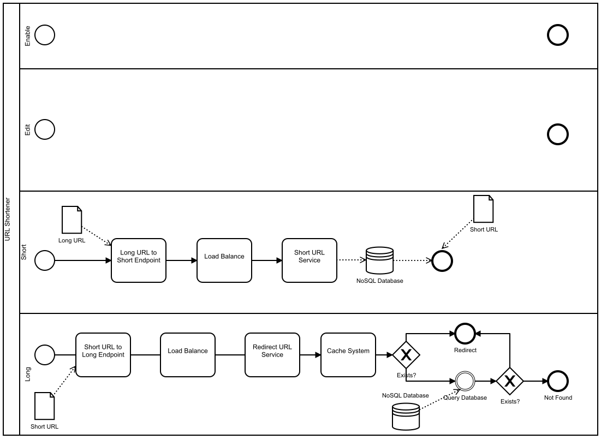

# url-shortener
URL Shortener service using the following stack:
1. Flask Framework for the API
2. Redis for Caching
3. DynamoDB for the Database

## Build and Run

Configure .env file following data:
```
DATA_PATH=/opt/app/data
URL_CHARS = 6
ENV=Dev
OUTPUT=json
AWS_DEFAULT_REGION=us-east-1
AWS_ACCESS_KEY_ID=<YOUR_ACCESS_KEY_ID_HERE>
AWS_SECRET_ACCESS_KEY=<YOUR_SECRET_KEY_HERE>
CACHE_TYPE=RedisCache
CACHE_REDIS_HOST=redis
CACHE_REDIS_PORT=6379
CACHE_REDIS_DB=0
CACHE_REDIS_URL=redis://redis:6379/0
CACHE_DEFAULT_TIMEOUT=500
```
Then, run with docker.

```bash
docker-compose up -d
```


## API
```
Swagger docs at: http://localhost:8000/docs
```

## Proccess Flow

Live updated versioned flow at: https://processos.ifpe.edu.br/d/227
